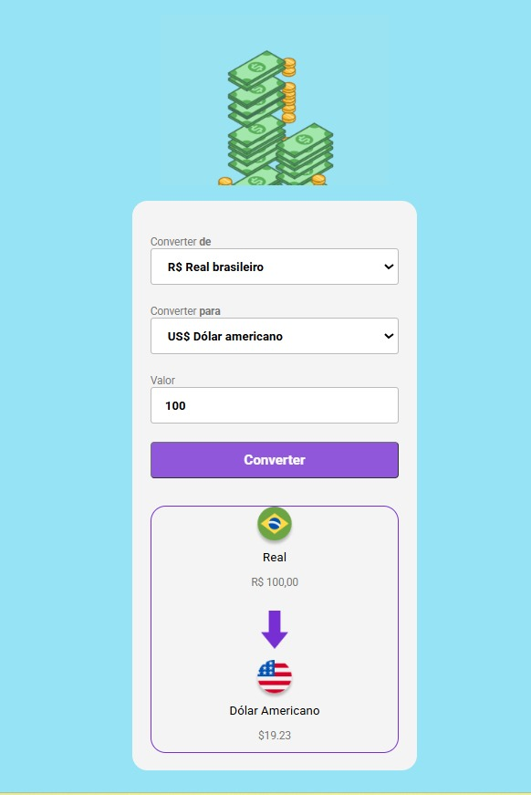

## 💱 Conversor de Moedas

Projeto de conversão de moedas desenvolvido com HTML, CSS e JavaScript.

O sistema permite converter valores de Real (BRL) para:

💵 Dólar Americano (USD)

💶 Euro (EUR)

## 🚀 Funcionalidades

* Conversão de Real para Dólar

* Conversão de Real para Euro

* Alteração dinâmica do nome da moeda

* Alteração dinâmica da bandeira

* Interface simples e intuitiva

## 🛠 Tecnologias Utilizadas

* HTML5

* CSS3

* JavaScript

## 📚 Aprendizados

Este projeto foi desenvolvido com foco em:

Manipulação do DOM

Eventos (click e change)

Estruturação de layout

Organização de código

Uso de boas práticas em commits

🔗 Acesse o projeto online: https://brunorael.github.io/projeto-conversor-de-moedas/

